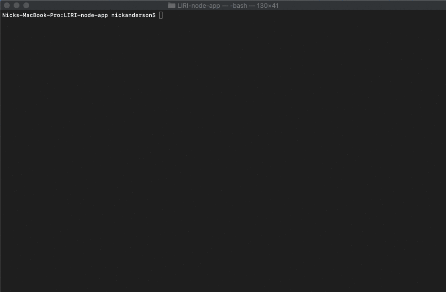
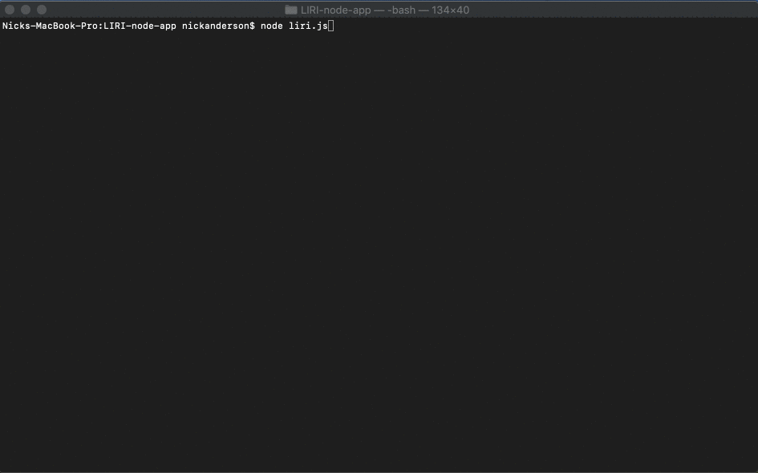

# LIRI node app

This node app has the ability to hit one of three APIs and retrieve some information. The user can search for a movie, song, or concert or their choosing. I went in a slightly different direction then the instructions. I tried modulirizing my code into seperate javascript sheets for each search and exporting the function to my main liri. js page. It worked! I also used the inquirer package to ask the user questions rather than using the process.argv[i].

## Movie Search

Very simple search, it defaulted to only return the top search result. Once selected, the movie search function asks what movie the user would like to search for and captures that input and hits the IMDB database with it.

## Song Search

Same as with the movie search with a few differences. The request is hitting Spotify instead of IMDB and requires some keys to do so. I used and set up .env to mask my personal keys.

## Concert Search

